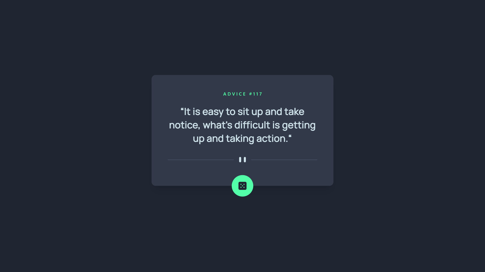

# Frontend Mentor - Advice generator app solution

This is a solution to the [Advice generator app challenge on Frontend Mentor](https://www.frontendmentor.io/challenges/advice-generator-app-QdUG-13db). Frontend Mentor challenges help you improve your coding skills by building realistic projects.

## Table of contents

- [Frontend Mentor - Advice generator app solution](#frontend-mentor---advice-generator-app-solution)
  - [Table of contents](#table-of-contents)
  - [Overview](#overview)
    - [The challenge](#the-challenge)
    - [Screenshot](#screenshot)
    - [Links](#links)
  - [My process](#my-process)
    - [Built with](#built-with)
    - [What I learned](#what-i-learned)
    - [Continued development](#continued-development)
    - [Useful resources](#useful-resources)
  - [Author](#author)
  - [Tip](#tip)

## Overview

### The challenge

Users should be able to:

- View the optimal layout for the app depending on their device's screen size
- See hover states for all interactive elements on the page
- Generate a new piece of advice by clicking the dice icon

### Screenshot

- Desktop View
  

- Phone View
  

- Lightromm test
  

### Links

- Solution URL: [Github](https://github.com/01kingmaker01/Challenge_1)

- Live Site URL: [Netlify](https://ketanchallenge.netlify.app/)

## My process

### Built with

- Semantic HTML5 markup
- CSS custom properties
- Flexbox
- CSS Grid
- Mobile-first workflow
- [TailwindCSS](https://tailwindcss.com/) - Utility-first CSS framework
- [Twin.Macro](https://github.com/ben-rogerson/twin.macro) -
  Twin blends the magic of Tailwind with the flexibility of css-in-js
- [React](https://reactjs.org/) - JS library
- [Styled Components](https://styled-components.com/) - For styles

### What I learned

Through these challenges, I have learned how to use TwinMacro more effectively.
I have used useState hook, and useEffect hook in the react functional component.
My CSS Flexbox and Grid knowledge has been brushed up.


```js
const Container = tw.div`mt-10 mb-6 text-secondary text-xs font-medium md:(mt-12 font-size[.85rem])`;
```

```html
<Container>....</Container>
```

### Continued development

I plan to refine and perfect Twin.Macro components and make code DRY in the future

### Useful resources

- [TailwindCSS](https://tailwindcss.com/) - I was able to see documentation for TailwindCSS and write classes for twin macro components through this resource
- [CSS Tricks](https://css-tricks.com/snippets/css/complete-guide-grid/) - Simple guide for CSS Grid

## Author

- Contra - [Ketan Chavan](https://contra.com/ketan_chavan)
- Frontend Mentor - [@01kingmaker01](https://www.frontendmentor.io/profile/01kingmaker01)
- Linkedin - [Ketan Chavan](https://www.linkedin.com/in/ketan-chavan/)

## Tip

You can learn CSS Flexbox by playing this game [Flexbox Froggy](https://flexboxfroggy.com/)

You can learn CSS Flexbox by playing this game [Grid Gardern](https://cssgridgarden.com/)

**Happy Coding 😃**
